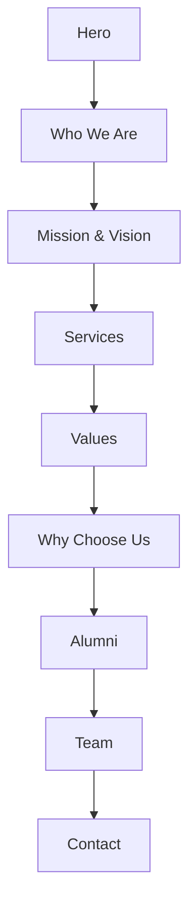

# About Us Page - Media & Flow

This module documents image sources, usage, and page flow for `app/(main)/about-us/page.tsx`.

## Image Map

- Hero background: `https://images.unsplash.com/photo-1523050854058-8df90110c9f1` (campus)
- Who We Are image: `https://images.unsplash.com/photo-1503676260728-1c00da094a0b` (workspace)
- Mission decor: `https://images.unsplash.com/photo-1581092580691-3007b4d69ce8` (decorative)
- Vision decor: `https://images.unsplash.com/photo-1521737604893-d14cc237f11d` (decorative)
- Services banner: `/pictures/marcin-nowak-iXqTqC-f6jI-unsplash.jpg` (local)
- Alumni background: `/pictures/sebastian-latorre-rrLyNHc9_Xc-unsplash.jpg` (local)

Services grid:
- Career: `https://images.unsplash.com/photo-1522071820081-009f0129c71c`
- Selection: `https://images.unsplash.com/photo-1523580846011-d3a5bc25702b`
- Docs: `https://images.unsplash.com/photo-1517245386807-bb43f82c33c4`
- Scholarship: `https://images.unsplash.com/photo-1558021212-51b6ecfa0db9`
- Visa: `https://images.unsplash.com/photo-1560520653-9e0e4c89e8da`
- Travel: `https://images.unsplash.com/photo-1502920917128-1aa500764ca4`

Team portraits:
- A: `https://images.unsplash.com/photo-1544005313-94ddf0286df2`
- B: `https://images.unsplash.com/photo-1524504388940-b1c1722653e1`
- C: `https://images.unsplash.com/photo-1552374196-c4e7ffc6e126`

All external images are optimized via Next.js `next/image`. Remote domains are configured in `next.config.ts` under `images.remotePatterns`.

## How to Change Images
Edit the centralized map in `page.tsx` under `IMAGE_SRC`. Swap URLs or point to local files placed in `/public`.

## Flow (Mermaid)

## Debugging
- In development, the page logs a single `[AboutPage] image map` console.debug to confirm bindings.

## Credits
- Unsplash photos per URLs above; ensure attribution if required by your policy.

