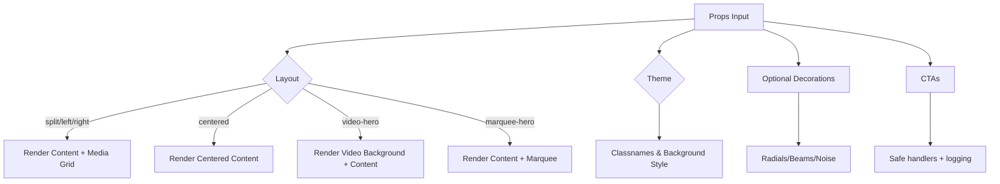

# AdvancedBanner Component

A powerful, reusable banner/hero component with multiple layouts, themes, CTAs, media (image/video), and tasteful decorations. Designed for high conversion and visual impact, while keeping usage simple and consistent across pages.

## Key Features
- Multiple layouts: `split`, `centered`, `left-graphic`, `right-graphic`, `video-hero`, `marquee-hero`
- Themes: `light`, `dark`, `gradient`, `glass`, `brand`
- Image or video background/media with overlay
- Primary/Secondary CTAs with safe logging and robust error handling
- Optional eyebrow/badge, subtitle, and description
- Optional decorative backgrounds (radials, beams, gradient wash, noise)
- Marquee items support for ticker-style highlights

## Props
```ts
export type AdvancedBannerProps = {
  id?: string
  layout?: BannerLayout
  theme?: BannerTheme
  eyebrow?: string | ReactNode
  title: ReactNode
  subtitle?: ReactNode
  description?: ReactNode
  primaryCta?: CTA
  secondaryCta?: CTA
  media?: Media // image | video | none
  marqueeItems?: string[]
  badge?: { text?: string; icon?: ReactNode; className?: string }
  className?: string
  containerClassName?: string
  contentClassName?: string
  mediaClassName?: string
  decoration?: {
    showBeams?: boolean
    showRadials?: boolean
    showNoise?: boolean
    gradientFrom?: string
    gradientVia?: string
    gradientTo?: string
  }
  minHeight?: string // e.g. "60vh", "80vh"
}
```

## Usage Examples

### Split layout with image
```tsx
import { AdvancedBanner } from "@/components/advanced-banner/AdvancedBanner";

<AdvancedBanner
  layout="split"
  theme="gradient"
  badge={{ text: "🌍 Global Opportunities" }}
  eyebrow="Premium Guidance"
  title={<span>Unlock Your Global Future</span>}
  subtitle="Study abroad made simple, transparent, and effective"
  description="From university selection to visas and beyond—our experts stay with you at every step."
  media={{ type: "image", src: "/pictures/priscilla-du-preez-AOdELn6senM-unsplash.jpg" }}
  primaryCta={{ label: "Start Your Journey", href: "/#journey" }}
  secondaryCta={{ label: "Explore Services", href: "/services" }}
  decoration={{ showRadials: true, showBeams: true, showNoise: true }}
/>
```

### Video hero
```tsx
<AdvancedBanner
  layout="video-hero"
  theme="dark"
  title={<>Visa Assistance for Studying Abroad</>}
  description={<>Seamless documentation to approvals with expert guidance.</>}
  media={{ type: "video", src: "https://example.com/hero.mp4", poster: "/pictures/priscilla-du-preez-AOdELn6senM-unsplash.jpg" }}
  primaryCta={{ label: "Talk to an Advisor", href: "#contact" }}
  secondaryCta={{ label: "Download Guide", href: "/guides/visa-guide.pdf" }}
/>
```

### Marquee hero
```tsx
<AdvancedBanner
  layout="marquee-hero"
  theme="brand"
  title="Trusted by students across 25+ countries"
  marqueeItems={["Fast approvals", "Scholarship guidance", "Top universities", "End-to-end support"]}
  primaryCta={{ label: "Get Started", href: "/#start" }}
/>
```

## Flow Chart



## Notes
- Uses `next/image` for built-in optimization; remote image domains configured in `next.config.ts`.
- Console logging is dev-only; will be silent in production.
- CTAs include robust try/catch logging for future debugging.
- Keep `minHeight` around `60vh`–`80vh` for strongest impact.

