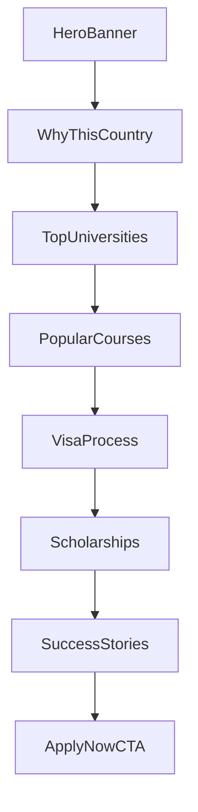

# Country Page - Visibility & Logos

This module documents fixes for text visibility and the university logo sources.

## Visibility Fixes
- Gradient text fallback added in `app/(main)/globals.css` and `app/(dashboard)/globals.css` (`.modern-gradient` now sets a fallback `color` and enables `background-clip: text`).
- Headings updated to include `text-foreground md:text-transparent` so text remains visible if gradient clip is unsupported.

## University Logos
Logos are now mapped to real assets (local or Wikipedia).

- Canada:
  - University of Toronto: `/universities/university-of-toronto-logo.png`
  - McGill University: `https://upload.wikimedia.org/wikipedia/en/3/33/McGill_University_CoA.svg`
  - University of British Columbia: `https://upload.wikimedia.org/wikipedia/commons/7/74/UBC_logo.png`
- USA:
  - Harvard University: `/universities/harvard-logo.png`
  - Stanford University: `https://upload.wikimedia.org/wikipedia/en/b/b7/Stanford_University_seal_2003.svg`
  - MIT: `https://upload.wikimedia.org/wikipedia/commons/0/0c/MIT_logo.svg`
- UK:
  - University of Oxford: `https://upload.wikimedia.org/wikipedia/commons/7/7a/Oxford_University_Circlet.svg`
  - University of Cambridge: `https://upload.wikimedia.org/wikipedia/en/0/06/University_of_Cambridge_coat_of_arms.svg`
  - Imperial College London: `https://upload.wikimedia.org/wikipedia/en/6/63/Imperial_College_London.svg`
- Australia:
  - Australian National University: `https://upload.wikimedia.org/wikipedia/en/3/35/Australian_National_University_coat_of_arms.svg`
  - University of Melbourne: `/universities/university-of-melbourne-logo.png`
  - University of Sydney: `https://upload.wikimedia.org/wikipedia/en/9/98/University_of_Sydney_coat_of_arms.svg`
- Germany:
  - Technical University of Munich: `https://upload.wikimedia.org/wikipedia/commons/d/d4/Technical_University_of_Munich_Logo.svg`
  - Heidelberg University: `https://upload.wikimedia.org/wikipedia/commons/b/b0/Uni_Heidelberg_Logo.svg`
  - Humboldt University: `https://upload.wikimedia.org/wikipedia/commons/d/d1/Logo_Humboldt-Universit%C3%A4t_zu_Berlin.svg`

Remote domains are allowed in `next.config.ts` under `images.remotePatterns`.

## Flow (Mermaid)

## Debugging
- Dev-only console: `[CountryPage] rendering` with country name, universities, and hero image.

