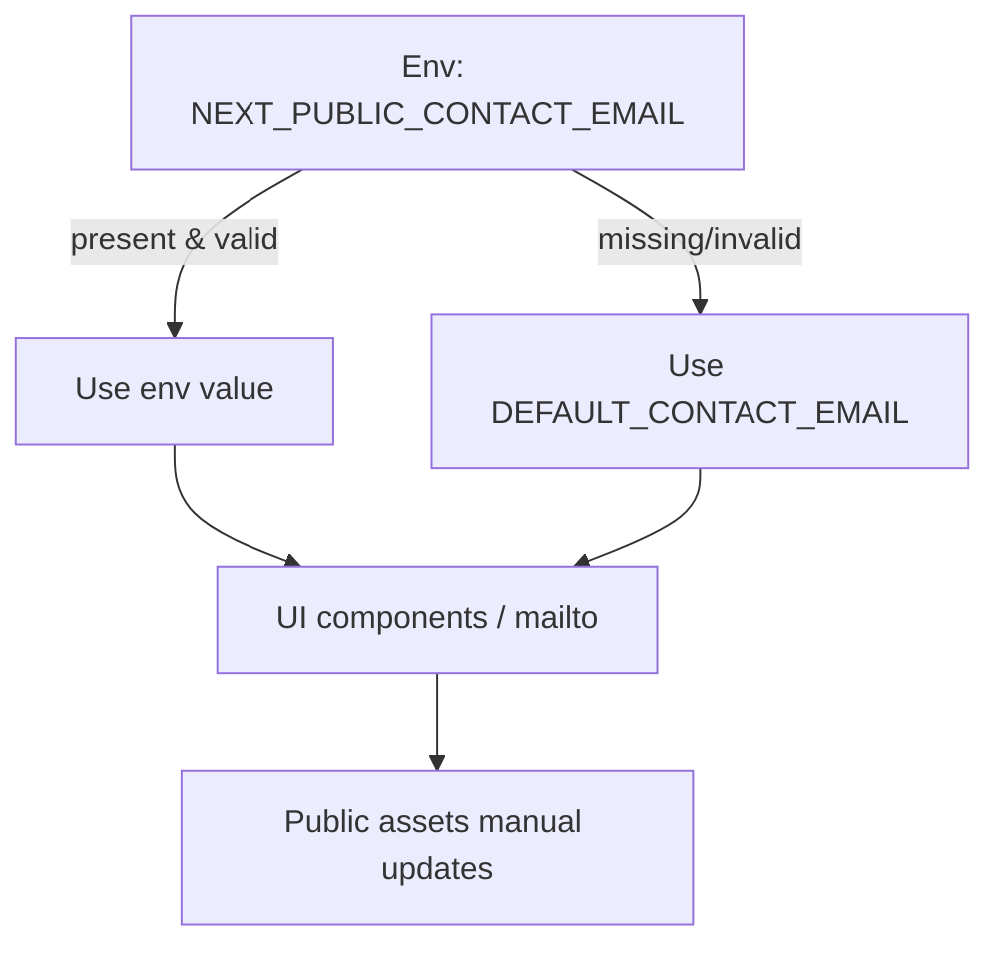

# Contact Email Usage

All UI and future backend code should use a single source of truth for the contact email.

- Env var: `NEXT_PUBLIC_CONTACT_EMAIL`
- Fallback: `admissions@ipdeducation.in`
- Accessor: `lib/contact.ts` (`getContactEmail`, `getMailtoHref`)

## Flowchart



## Debugging

- Helper logs its source and validation to the console.
- Click handlers in UI log the `mailto:` being opened and provide user-facing fallbacks.

## How to use in UI

```tsx
import { getContactEmail, getMailtoHref } from '@/lib/contact'

<a href={getMailtoHref()}>{getContactEmail()}</a>
```

## Backend usage

```ts
import { CONTACT_EMAIL } from '@/lib/email'
```
