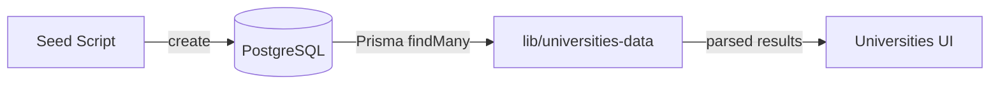

# Universities Data Model

This document describes the data model for `University`, how it is stored in PostgreSQL using Prisma, and the seed → fetch → UI flow.

## Prisma Model

```95:126:/home/sonuram/Desktop/DevOPS/carer-growth-app/prisma/schema.prisma
model University {
  id                 String    @id @default(cuid())
  slug               String    @unique
  name               String
  country            String
  city               String?
  logoUrl            String?
  heroImageUrl       String?
  shortDescription   String?
  description        String?   @db.Text
  website            String?
  contact            Json?
  exams              String[]
  visaSupport        Boolean   @default(false)
  accommodation      Boolean   @default(false)
  forex              Boolean   @default(false)
  counselling        Boolean   @default(false)
  applicationFeeWaiver Boolean @default(false)
  scholarshipsHelp   Boolean   @default(false)
  courses            Json[]
  tags               String[]
  createdAt          DateTime  @default(now())
  updatedAt          DateTime  @updatedAt
  @@map("universities")
}
```

## Expected PostgreSQL Types

- `exams`: TEXT[]
- `tags`: TEXT[]
- `courses`: JSONB[] (array of JSON objects)
- `contact`: JSONB (single JSON object)

If your DB currently stores `exams`/`tags` as JSON or `courses` as a single JSON array, run the migration below.

## Migration

Run the provided SQL to convert columns in-place (idempotent for expected shapes):

```sql
-- scripts/migrate_universities_arrays.sql
```

Command:

```bash
npm run db:migrate:universities-arrays
```

Requires `DATABASE_URL` environment variable.

## Seeding

Use the standardized seed script with generated Prisma client (no TS path aliases):

```bash
npm run prisma:gen
npm run db:seed:universities
```

## Fetching and UI

`lib/universities-data.ts` includes defensive logging and parsing for `courses`:

- Logs first row shapes for `exams`, `tags`, and `courses`
- Safely maps `courses` when it is an array; otherwise falls back to `[]`
- `getAllExams` guards against non-array values

## Troubleshooting

- Error: "List field did not return an Array… Type identifier was String":
  - Cause: column type mismatch (JSON vs TEXT[]/JSONB[])
  - Fix: run the migration, re-seed, and reload

## Flow Chart




