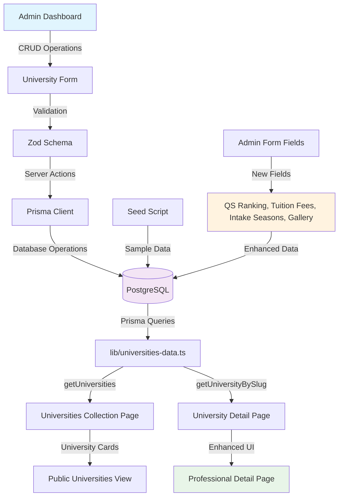

# Universities Data Model

This document describes the data model for `University`, how it is stored in PostgreSQL using Prisma, and the seed → fetch → UI flow.

## Prisma Model

```95:133:/home/sonuram/Desktop/DevOPS/carer-growth-app/prisma/schema.prisma
model University {
  id                 String    @id @default(cuid())
  slug               String    @unique
  name               String
  country            String
  city               String?
  logoUrl            String?
  heroImageUrl       String?
  shortDescription   String?
  description        String?   @db.Text
  website            String?
  contact            Json?     // Stores contact details like { email, phone, address }
  exams              String[]  // List of accepted exams like ["IELTS", "TOEFL"]
  visaSupport        Boolean   @default(false)
  accommodation      Boolean   @default(false)
  forex              Boolean   @default(false)
  counselling        Boolean   @default(false)
  applicationFeeWaiver Boolean @default(false)
  scholarshipsHelp   Boolean   @default(false)
  courses            Json[]    // Stores a list of course objects
  tags               String[]
  // Additional fields for enhanced university information
  qsRanking          Int?      // QS World University Ranking
  tuitionFeeFrom    Int?      // Minimum tuition fee per year in USD
  tuitionFeeTo      Int?      // Maximum tuition fee per year in USD
  intakeSeasons     String[]  @default([]) // Available intake seasons like ["Fall", "Spring"]
  galleryImageUrls  String[]  @default([]) // Array of gallery image URLs
  createdAt          DateTime  @default(now())
  updatedAt          DateTime  @updatedAt
  @@map("universities")
}
```

## Expected PostgreSQL Types

- `exams`: TEXT[]
- `tags`: TEXT[]
- `courses`: JSONB[] (array of JSON objects)
- `contact`: JSONB (single JSON object)
- `qsRanking`: INTEGER (nullable)
- `tuitionFeeFrom`: INTEGER (nullable)
- `tuitionFeeTo`: INTEGER (nullable)
- `intakeSeasons`: TEXT[] (array of strings)
- `galleryImageUrls`: TEXT[] (array of strings)

If your DB currently stores `exams`/`tags` as JSON or `courses` as a single JSON array, run the migration below.

## Migration

Run the provided SQL to convert columns in-place (idempotent for expected shapes):

```sql
-- scripts/migrate_universities_arrays.sql
```

Command:

```bash
npm run db:migrate:universities-arrays
```

Requires `DATABASE_URL` environment variable.

## Seeding

Use the standardized seed script with generated Prisma client (no TS path aliases):

```bash
npm run prisma:gen
npm run db:seed:universities
```

## Fetching and UI

`lib/universities-data.ts` includes defensive logging and parsing for `courses`:

- Logs first row shapes for `exams`, `tags`, and `courses`
- Safely maps `courses` when it is an array; otherwise falls back to `[]`
- `getAllExams` guards against non-array values

## Troubleshooting

- Error: "List field did not return an Array… Type identifier was String":
  - Cause: column type mismatch (JSON vs TEXT[]/JSONB[])
  - Fix: run the migration, re-seed, and reload

## Flow Chart



## Enhanced Features

### New Database Fields
- **QS Ranking**: Optional integer for world university ranking
- **Tuition Fee Range**: Min/max annual fees in USD
- **Intake Seasons**: Array of available intake periods
- **Gallery Images**: Array of campus image URLs

### Admin Form Enhancements
- **Key Information Section**: QS ranking and tuition fee inputs
- **Intake Seasons**: Multi-select with common options
- **Gallery Management**: Dynamic image URL management with preview

### Public Page Enhancements
- **Professional Hero Section**: Enhanced gradients and styling
- **Modern Tabbed Interface**: Smooth transitions and better organization
- **Premium Course Cards**: Hover effects and better typography
- **Responsive Gallery**: Lightbox-ready styling with hover effects
- **Enhanced Sidebar**: Sticky positioning and modern design


